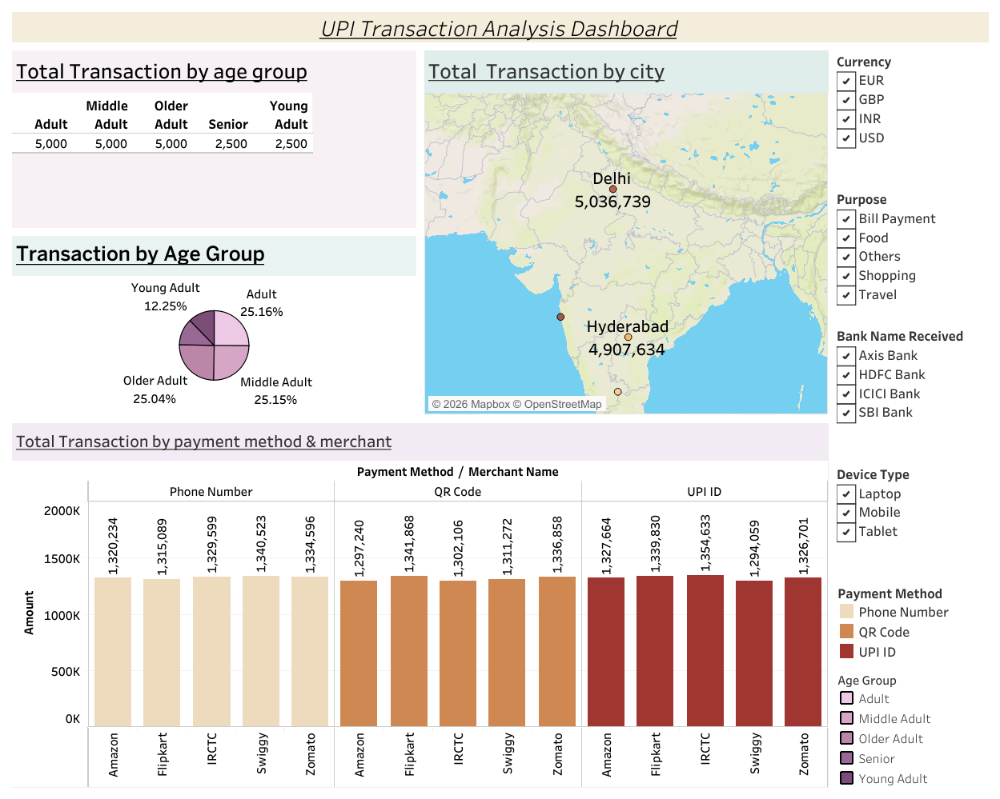

# UPI Transaction Analysis Dashboard

An interactive Tableau dashboard analyzing UPI (Unified Payments Interface) transaction data across cities, age groups, payment methods, and merchants.



## 🔗 Live Dashboard
[View on Tableau Public](#) <!-- replace # with your published Tableau Public link -->

## 📊 Overview
This project explores a synthetic UPI transactions dataset to uncover patterns in digital payment behavior — who is transacting, where, how much, and through which channels. The dashboard is built in Tableau and supports filtering by currency, purpose, bank, device type, and payment method.

## 🗂️ Dataset
`data/UPI_Transactions.xlsx`

| Column | Description |
|---|---|
| TransactionID | Unique transaction identifier |
| TransactionDate | Date of transaction |
| Amount | Transaction amount |
| BankNameSent / BankNameReceived | Sending and receiving banks |
| RemainingBalance | Balance after transaction |
| City | Transaction city |
| Gender | Customer gender |
| TransactionType | Transfer / Payment |
| Status | Success / Failed / Pending |
| DeviceType | Laptop / Mobile / Tablet |
| PaymentMethod | Phone Number / QR Code / UPI ID |
| MerchantName | Merchant (Amazon, Flipkart, IRCTC, Swiggy, Zomato) |
| Purpose | Bill Payment / Food / Shopping / Travel / Others |
| CustomerAge | Age of the customer |
| PaymentMode | Instant / Scheduled |
| Currency | INR / USD / EUR / GBP |
| CustomerAccountNumber / MerchantAccountNumber | Account identifiers |

## 📈 Key Visuals
- **Total Transactions by Age Group** — breakdown across Adult, Middle Adult, Older Adult, Senior, and Young Adult segments
- **Total Transactions by City** — geographic distribution on a map (Delhi, Hyderabad, Mumbai, and more)
- **Total Transactions by Payment Method & Merchant** — comparison across Phone Number, QR Code, and UPI ID, cross-referenced with top merchants
- **Interactive filters** — Currency, Purpose, Bank Name Received, Device Type, Payment Method, Age Group

## 🛠️ Tools Used
- **Tableau Public / Desktop** — dashboard design and interactivity
- **Excel** — source data storage

## 📁 Repository Structure
```
UPI-Transaction-Analysis-Dashboard/
├── data/
│   └── UPI_Transactions.xlsx        # Source dataset
├── dashboard/
│   ├── UPI_Transaction_Dashboard.twbx   # Tableau packaged workbook (add this)
│   └── UPI_Transaction_Analysis_Dashboard.pdf
├── images/
│   └── dashboard_preview.png        # Dashboard screenshot
└── README.md
```

## 🚀 How to Use
1. Clone the repo
   ```bash
   git clone https://github.com/<your-username>/UPI-Transaction-Analysis-Dashboard.git
   ```
2. Open `dashboard/UPI_Transaction_Dashboard.twbx` in [Tableau Desktop](https://www.tableau.com/products/desktop) or Tableau Public (free), **or**
3. View the static preview: `dashboard/UPI_Transaction_Analysis_Dashboard.pdf`

## 📌 Insights
- Adult, Middle Adult, and Older Adult segments each account for roughly a quarter of total transactions, with Young Adults and Seniors trailing at ~12% each.
- Transaction volume is fairly evenly split across all three payment methods (Phone Number, QR Code, UPI ID) and across the five merchants tracked, suggesting no single channel or merchant dominates.
- Delhi and Hyderabad are the leading cities by transaction value.

## 👤 Author
**[Your Name]**
[LinkedIn](#) · [Portfolio](#)

## 📄 License
This project is licensed under the MIT License — feel free to reuse with attribution.
